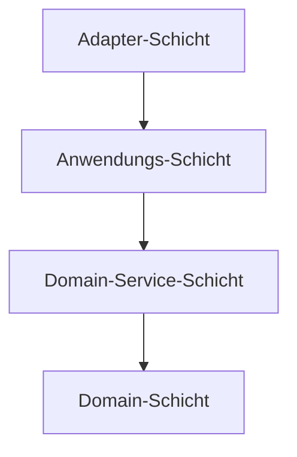

# Architekturübersicht

Dieser Operator wurde nach den Prinzipien des Domain-Driven Design (DDD) entwickelt. Ziel ist es, die Kernlogik von den Implementierungsdetails der umgebenden Infrastruktur (wie Kubernetes) zu trennen. Dies macht den Code einfacher zu testen, zu warten und zu verstehen.

Der Code ist in verschiedene Schichten unterteilt, jede mit einer spezifischen Verantwortung. Die grundlegende Regel ist, dass Abhängigkeiten nur nach innen zeigen: `Adapter` -> `Application` -> `DomainService` -> `Domain`.

## Schichten

### `pkg/domain`
Dies ist das Herzstück des Operators. Es enthält die Kernlogik, Regeln und Datenstrukturen (Aggregate und Value Objects), die den Problembereich repräsentieren.

- **Inhalt:** Reine Datenstrukturen (`BlueprintSpec`, `StateDiff`, `Dogu`) und die Logik zur Aufrechterhaltung ihrer Konsistenz.
- **Hauptregel:** Diese Schicht hat **keine** Abhängigkeiten von anderen Schichten im Projekt. Sie weiß nichts über Kubernetes, Repositories oder Anwendungsfälle.

### `pkg/domainservice`
Diese Schicht enthält Domainlogik, die nicht natürlich in ein einzelnes Domain-Aggregat passt. Sie orchestriert oft Aktionen zwischen mehreren Domainobjekten.

- **Inhalt:** Dienste, die komplexe Validierungen oder Berechnungen durchführen, z. B. `ValidateDependenciesDomainUseCase`, das Abhängigkeiten über mehrere Dogus hinweg überprüfen muss.
- **Hauptregel:** Hängt nur von der `domain`-Schicht ab.

### `pkg/application`
Diese Schicht definiert die spezifischen Anwendungsfälle des Operators. Sie dient als Einstiegspunkt für externe Akteure (wie den Kubernetes-Controller), um mit der Anwendung zu interagieren.

- **Inhalt:** Anwendungsfälle wie `BlueprintSpecChangeUseCase`, der den gesamten Prozess des Empfangens einer Blueprint-Änderung, deren Vorbereitung und Anwendung orchestriert.
- **Hauptregel:** Sie steuert den Datenfluss und verwendet `domainservice`s und `domain`-Objekte, um ihre Aufgaben auszuführen. Sie hängt von Interfaces für Repositories ab, aber nicht von deren konkreten Implementierungen.

### `pkg/adapter`
Dies ist die äußerste Schicht, die für die Interaktion mit der Außenwelt verantwortlich ist. Sie passt externe Technologien für die Verwendung durch die Anwendungsschicht an.

- **Inhalt:**
    - **Kubernetes Controller:** Der `BlueprintReconciler` lauscht auf Änderungen an CRDs.
    - **Repositories:** Konkrete Implementierungen der in der `domainservice`-Schicht definierten Repository-Interfaces (z. B. `blueprintSpecCRRepository`, das `BlueprintSpec`-Domainobjekte in/aus Kubernetes speichert/lädt).
    - **Serializers:** Code, der zwischen `domain`-Objekten und ihren Kubernetes CRD-Darstellungen übersetzt.
- **Hauptregel:** Diese Schicht ist der "Klebstoff", der die Anwendung mit z.B. Kubernetes verbindet. Sie hängt von allen inneren Schichten ab.

### `pkg/config`
Dieses Paket ist für die gesamte Operator-Konfiguration verantwortlich, hauptsächlich für das Lesen und Parsen von Umgebungsvariablen.

---

## Entwicklungsprinzipien

Um die Integrität dieser Architektur zu wahren, beachten Sie bitte die folgenden Prinzipien beim Hinzufügen oder Ändern von Code.

1.  **Die Abhängigkeitsregel ist eine harte Regel.** Code in einer inneren Schicht **darf nicht** aus einer äußeren Schicht importieren oder darauf verweisen.
    - `domain` weiß nichts über `application` oder `adapter`.
    - `application` weiß nichts über `adapter`.

2.  **Domainobjekte schützen ihre eigenen Invarianten.** Alle Änderungen am Zustand eines Domainobjekts sollten über Methoden dieses Objekts (das "Aggregate Root") vorgenommen werden. Greifen Sie nicht von einer äußeren Schicht in ein Domainobjekt ein, um dessen Felder direkt zu ändern. Dies stellt sicher, dass das Objekt immer in einem konsistenten Zustand ist.

3.  **Repositories gehören zur `adapter`-Schicht.** Die `domainservice`-Schicht definiert die *Interfaces* für ein Repository (was die Anwendung benötigt), aber die konkrete Implementierung (wie es gemacht wird, z. B. mit einem Kubernetes-Client) befindet sich in der `adapter`-Schicht.

4.  **Anwendungsfälle treiben die Anwendung an.** Jede neue Funktion sollte als Anwendungsfall in der `application`-Schicht ausgedrückt werden. Der Controller in der `adapter`-Schicht sollte "dünn" gehalten werden und hauptsächlich an diese Anwendungsfälle delegieren.

5.  **Externe Abhängigkeiten in der `adapter`-Schicht halten.** Wenn Sie mit einem neuen externen Dienst oder einer Bibliothek interagieren müssen, gehört der Code für diese Interaktion in einen Adapter. Dies isoliert externe Abhängigkeiten und erleichtert deren Austausch oder Mocking für Tests.