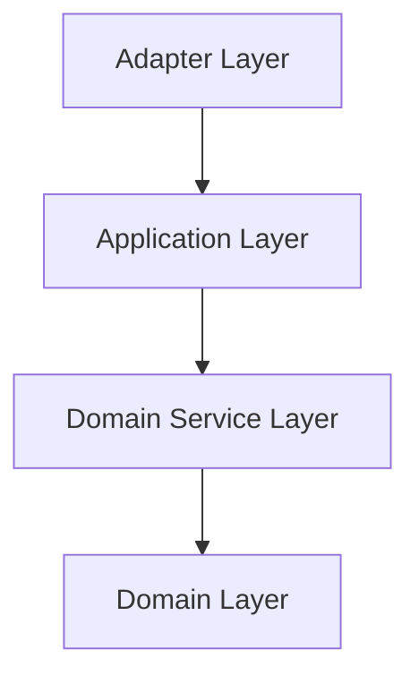

# Architecture Overview

This operator is built following the principles of Domain-Driven Design (DDD). The goal is to separate the core business logic from the implementation details of the surrounding infrastructure (like Kubernetes). This makes the code easier to test, maintain, and understand.

The code is organized into distinct layers, each with a specific responsibility. The fundamental rule is that dependencies only point inwards: `Adapter` -> `Application` -> `DomainService` -> `Domain`.

## Layers

### `pkg/domain`
This is the heart of the operator. It contains the core business logic, rules, and data structures (Aggregates and Value Objects) that represent the problem space.

- **Content:** Pure data structures (`BlueprintSpec`, `StateDiff`, `Dogu`) and the logic to maintain their consistency.
- **Key Rule:** This layer has **zero** dependencies on any other layer in the project. It knows nothing about Kubernetes, repositories, or use cases.

### `pkg/domainservice`
This layer contains domain logic that doesn't naturally fit within a single domain aggregate. It often orchestrates actions between multiple domain objects.

- **Content:** Services that perform complex validations or calculations, e.g., `ValidateDependenciesDomainUseCase` which needs to check dependencies across multiple dogus.
- **Key Rule:** Depends only on the `domain` layer.

### `pkg/application`
This layer defines the specific use cases of the operator. It acts as an entrypoint for external actors (like the Kubernetes controller) to interact with the application.

- **Content:** Use cases like `BlueprintSpecChangeUseCase` which orchestrates the entire process of receiving a blueprint change, preparing it, and applying it.
- **Key Rule:** It directs the flow of data, using `domainservice`s and `domain` objects to perform its tasks. It depends on interfaces for repositories but not their concrete implementations.

### `pkg/adapter`
This is the outermost layer, responsible for interacting with the outside world. It adapts external technologies for use by the application layer.

- **Content:**
    - **Kubernetes Controller:** The `BlueprintReconciler` listens for changes to CRDs.
    - **Repositories:** Concrete implementations of the repository interfaces defined in the `domainservice` layer (e.g., `blueprintSpecCRRepository` which saves/loads `BlueprintSpec` domain objects to/from Kubernetes).
    - **Serializers:** Code that translates between `domain` objects and their Kubernetes CRD representations.
- **Key Rule:** This layer is the "glue" that connects the application to Kubernetes. It depends on all inner layers.

### `pkg/config`
This package is responsible for all operator-level configuration, primarily reading and parsing environment variables.

---

## Development Principles

To maintain the integrity of this architecture, please adhere to the following principles when adding or modifying code.

1.  **The Dependency Rule is a hard rule.** Code in an inner layer **must not** import from or reference code in an outer layer.
    - `domain` knows nothing about `application` or `adapter`.
    - `application` knows nothing about `adapter`.

2.  **Domain objects protect their own invariants.** All changes to a domain object's state should be made through methods on that object (the "Aggregate Root"). Do not reach into a domain object from an outer layer to change its fields directly. This ensures the object is always in a consistent state.

3.  **Repositories belong to the `adapter` layer.** The `domainservice` layer defines the *interface* for a repository (what the application needs), but the concrete implementation (how it's done, e.g., with a Kubernetes client) lives in the `adapter` layer.

4.  **Use cases drive the application.** Any new feature should be expressed as a use case in the `application` layer. The controller in the `adapter` layer should be kept "thin" and primarily delegate to these use cases.

5.  **Keep external dependencies in the `adapter` layer.** If you need to interact with a new external service or library, the code for that interaction belongs in an adapter. This isolates external dependencies and makes them easier to replace or mock for tests.
