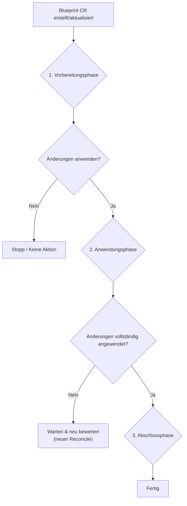

# Der Blueprint-Lebenszyklus

Wenn eine `Blueprint`-Custom-Resource im Cluster erstellt oder aktualisiert wird, beginnt der `k8s-blueprint-operator` einen Reconciliation-Prozess, um den tatsächlichen Zustand des Ecosystems an den im Blueprint definierten gewünschten Zustand anzupassen. Dieser Prozess ist der Blueprint-Lebenszyklus.

Der Lebenszyklus kann in drei Hauptphasen unterteilt werden: **Vorbereitung**, **Anwendung** und **Abschluss**.

---

### 1. Vorbereitungsphase

In dieser anfänglichen Phase validiert der Operator das Blueprint und bestimmt genau, welche Arbeiten ausgeführt werden müssen. Es werden keine Änderungen am Ecosystem selbst vorgenommen.

Die wichtigsten Schritte sind:

1.  **Statische Validierung:** Der Operator überprüft zunächst die Syntax und Struktur der Felder `blueprint` und `blueprintMask`, um sicherzustellen, dass sie valide sind.
2.  **Effektives Blueprint berechnen:** Anschließend wendet er die `blueprintMask` auf das `blueprint` an, um ein endgültiges, "effektives" Blueprint zu generieren. Dies ist der definitive gewünschte Zustand.
3.  **Dynamische Validierung:** Das effektive Blueprint wird anhand der Regeln des Ecosystems validiert. Dies beinhaltet die Überprüfung auf fehlende Dogu-Abhängigkeiten (z. B. Sicherstellen, dass `redmine` ein `postgresql`-Dogu zum Verbinden hat).
4.  **Ecosystem Health Check:** Der Operator überprüft, ob die aktuell installierten Dogus healthy sind. Standardmäßig wird er nicht fortfahren, wenn sich das Ecosystem nicht in einem healthy Zustand befindet.
5.  **StateDiff bestimmen:** Dies ist der kritischste Schritt. Der Operator vergleicht das *effektive Blueprint* mit dem *tatsächlichen Zustand* des Clusters. Das Ergebnis ist ein `StateDiff`, eine detaillierte Liste aller Aktionen, die zur Abstimmung des Zustands erforderlich sind. Dieser Diff wird in das Feld `status.stateDiff` der `Blueprint`-Ressource geschrieben, was Ihnen eine transparente Ansicht dessen gibt, was als Nächstes passieren wird.

### 2. Anwendungsphase

Wenn der `StateDiff` aus der Vorbereitungsphase nicht leer ist und das Blueprint nicht als `stopped` markiert ist, fährt der Operator fort, die erforderlichen Änderungen anzuwenden.

Die Reihenfolge der Operationen ist wichtig:

1.  **Konfiguration anwenden:** Alle Änderungen an globalen und Dogu-spezifischen Konfigurationen werden zuerst angewendet.
2.  **Dogu-Änderungen anwenden:** Der Operator löst die Installation, das Upgrade oder die Deinstallation von Dogus aus, wie im `StateDiff` definiert.
3.  **Warten, bis sich das Ecosystem stabilisiert hat:** Nach dem Anwenden der Änderungen tritt der Operator in eine Wartezeit ein. Er überprüft kontinuierlich den Health-Status des Ecosystems und wartet, bis alle geänderten Dogus melden, dass sie die richtige Version ausführen und die neue Konfiguration erfolgreich übernommen haben. Dies kann mehrere Reconciliation-Loops dauern.

### 3. Abschlussphase

Sobald alle Aktionen im `StateDiff` erfolgreich ausgeführt wurden und das Ecosystem stabil und healthy ist, tritt der Operator in die letzte Phase ein.

1.  **Als abgeschlossen markieren:** Der Operator aktualisiert den Status der `Blueprint`-Ressource und setzt die Bedingung `Completed` auf `true`.
2.  **Leerlauf:** Die Arbeit des Operators für diese Version des Blueprints ist nun abgeschlossen. Er bleibt im Leerlauf, bis eine neue Änderung an der `Blueprint`-Ressource oder an Ressourcen, die vom Blueprint-Operator angewendet werden (Dogu-CRs, ConfigMaps, Secrets), vorgenommen wird, wodurch der gesamte Lebenszyklus erneut beginnt.

### Das `stopped`-Flag

Sie können das `spec.stopped`-Flag in Ihrer `Blueprint`-Ressource auf `true` setzen. Wenn dieses Flag gesetzt ist, wird der Lebenszyklus nach der **Vorbereitungsphase** angehalten. Der Operator berechnet den `StateDiff` und schreibt ihn in den Status, aber er wird **keine** Änderungen anwenden.

Dies bietet einen "Dry Run"-Mechanismus, der es Ihnen ermöglicht, die Änderungen, die der Operator vornehmen möchte, sicher vorab zu überprüfen, bevor Sie ihn fortfahren lassen.
