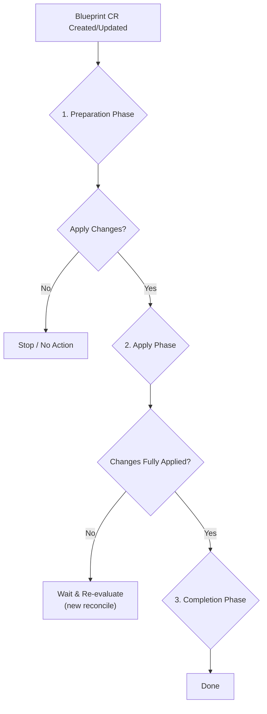

# The Blueprint Lifecycle

When a `Blueprint` custom resource is created or updated in the cluster, the `k8s-blueprint-operator` begins a reconciliation process to make the actual state of the ecosystem match the desired state defined in the blueprint. This process is the blueprint lifecycle.

The lifecycle can be broken down into three main phases: **Preparation**, **Apply**, and **Completion**.

---

### 1. Preparation Phase

In this initial phase, the operator validates the blueprint and determines exactly what work needs to be done. It does not make any changes to the ecosystem itself.

The key steps are:

1.  **Static Validation:** The operator first checks the syntax and structure of the `blueprint` and `blueprintMask` fields to ensure they are well-formed.
2.  **Calculate Effective Blueprint:** It then applies the `blueprintMask` to the `blueprint` to generate a final, "effective" blueprint. This is the definitive desired state.
3.  **Dynamic Validation:** The effective blueprint is validated against the ecosystem's rules. This includes checking for missing dogu dependencies (e.g., ensuring `redmine` has a `postgresql` dogu to connect to).
4.  **Ecosystem Health Check:** The operator checks if the currently installed dogus are healthy. By default, it will not proceed if the ecosystem is in an unhealthy state.
5.  **Determine State Diff:** This is the most critical step. The operator compares the *effective blueprint* with the *actual state* of the cluster. The result is a `StateDiff`, which is a detailed list of all actions required to reconcile the state. This diff is written to the `status.stateDiff` field of the `Blueprint` resource, giving you a transparent view of what will happen next.

### 2. Apply Phase

If the `StateDiff` from the preparation phase is not empty and the blueprint is not marked as `stopped`, the operator proceeds to apply the required changes.

The order of operations is important:

1.  **Apply Configuration:** All changes to global and dogu-specific configurations are applied first.
2.  **Apply Dogu Changes:** The operator triggers the installation, upgrade, or uninstallation of dogus as defined in the `StateDiff`.
3.  **Wait for Ecosystem to Stabilize:** After applying changes, the operator enters a waiting period. It continuously checks the health of the ecosystem and waits for all modified dogus to report that they are running the correct version and have successfully consumed the new configuration. This may take several reconciliation loops.

### 3. Completion Phase

Once all actions in the `StateDiff` have been successfully executed and the ecosystem is stable and healthy, the operator enters the final phase.

1.  **Mark as Completed:** The operator updates the `Blueprint` resource's status, setting the `Completed` condition to `true`.
2.  **Idle:** The operator's work for this version of the blueprint is now done. It will remain idle until a new change is made to the `Blueprint` resource or any resources applied by the blueprint-operator (Dogu-CRs, ConfigMaps, Secrets), which will start the entire lifecycle over again.

### The `stopped` Flag

You can set the `spec.stopped` flag to `true` in your `Blueprint` resource. If this flag is set, the lifecycle will halt after the **Preparation Phase**. The operator will calculate the `StateDiff` and write it to the status, but it will **not** apply any changes.

This provides a "dry run" mechanism, allowing you to safely preview the changes the operator intends to make before letting it proceed.
